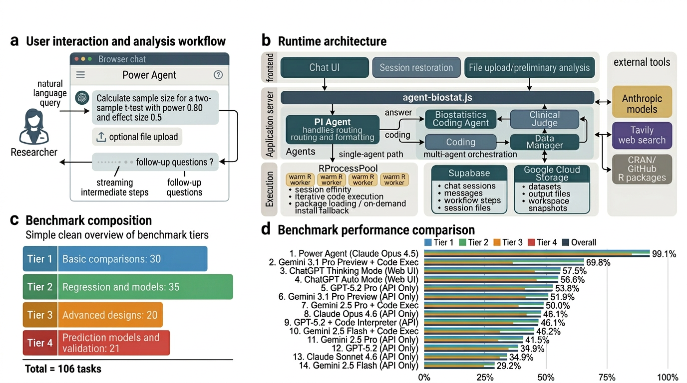

# Power Agent — Autonomous Power & Sample-Size Analysis Agent

> **STAI-X Challenge 2026 — Award C submission (Statistical Skill / Agent Module)**
> Team: **PowerBot** · Live product: **https://power-agent.io/**

Power Agent turns a plain-English study-design question into a **verified** power or
sample-size calculation. It plans the analysis, writes and runs the R code in a
sandbox, self-corrects on errors, and returns the result together with the
reproducible script, a report, and plots.

It is built for biostatisticians, clinical-trial designers, and applied researchers
who need defensible power analyses without hand-coding `pwr`, `gsDesign`, `swdpwr`,
`WebPower`, `longpower`, and dozens of other R packages.

---

## Why it exists

Power and sample-size analysis is high-stakes (it sizes real trials) but the tooling
is fragmented across ~50 R packages, each with its own parameterization. Practitioners
either over-rely on a single calculator or mis-apply a package. Power Agent wraps the
**plan → generate R → execute in sandbox → observe → self-correct → report** loop so
the calculation is both *automated* and *auditable*.

## What makes it a reusable module

- **Task-agnostic agent loop.** The plan/execute/verify loop is not tied to power
  analysis — point it at any R-based statistical task and it works without retuning.
- **Sandboxed R execution as a service.** On-demand R execution on Google Cloud Run
  with automatic CRAN/Bioconductor package install — other agents can call it as a worker.
- **Benchmark-verified.** Evaluated on a 989-task internal benchmark plus **117 tasks
  from 4 independent published benchmarks** (see [`cross-benchmark/`](cross-benchmark/)),
  reaching **72.6% exact-match** with R / G*Power ground truth.
- **Reproducibility built in.** Every answer ships the exact R script and a report.

## Architecture



| Component | What it does |
|---|---|
| **Brain / LLM** | Claude, multi-model routing — Haiku 4.5 for fast file/intent classification, Sonnet 4.6 for R code generation + self-correction, Opus 4.6 for planning and result interpretation |
| **Memory** | Conversation state, uploaded data/template context, a persistent R process pool for session continuity, cached benchmark ground-truth store |
| **Planning** | A Planning/Inference (PI) agent decides direct-answer vs. code-execution; an orchestrator-worker pattern decomposes the request and routes data tasks to the R coding agent |
| **Action** | Generates and runs R code; web search (Tavily / Firecrawl) for statistical methods and references; file parsing (PDF / DOCX / CSV); report and plot generation |
| **Execution** | Sandboxed R execution in isolated Google Cloud Run containers with on-demand package installation |
| **Observation** | Parses R stdout/stderr, detects errors, iterates with a self-correction loop; validates outputs against expected result templates |
| **Response** | Chat answer + reproducible R script + formatted report (PDF/Markdown) + plots and CSVs |

Full design notes: [`docs/ARCHITECTURE.md`](docs/ARCHITECTURE.md).

## Repository layout

```
.
├── backend/            # The agent: orchestrator, PI agent, R coding agent, executors, tools
├── frontend/           # Chat UI
├── public/             # Deployed static frontend
├── docs/ARCHITECTURE.md# Multi-agent design (orchestrator-worker pattern)
├── examples/           # Minimal usage scripts
├── cross-benchmark/    # Independent 4-benchmark / 117-task evaluation + results
├── assets/             # Architecture diagram, leaderboard, UI screenshots, slides
├── .claude/            # Claude Code config + skills
├── CLAUDE.md           # Persistent guidance for the agent
└── AWARD_C_SUBMISSION.md  # The STAI-X Award C post
```

## Quick start (run it yourself)

The hosted product is at **https://power-agent.io/** — no setup needed. To run locally:

### Prerequisites
- Node.js >= 18
- An Anthropic API key
- (Optional) Google Cloud credentials for the Cloud Run R executor

### Install & run
```bash
git clone https://github.com/ykzeng-yale/Power-Agent-Public-STAI-X.git
cd Power-Agent-Public-STAI-X
npm install
cp .env.example .env        # then edit .env with your keys
npm start                   # serves on http://localhost:3000
```

### Environment variables
| Variable | Required | Purpose |
|---|---|---|
| `ANTHROPIC_API_KEY` | yes | Claude API access |
| `GOOGLE_APPLICATION_CREDENTIALS_JSON` | optional | Cloud Run R executor |
| `TAVILY_API_KEY` / `FIRECRAWL_API_KEY` | optional | web search for methods/references |
| `PORT` | optional | server port (default 3000) |

## Usage tutorial

The pipeline takes one natural-language request and returns a verified answer + script + report.

**1. Sample-size calculation**
```
Calculate the sample size for a two-sample t-test with 80% power,
alpha = 0.05, and an effect size of 0.5.
```

**2. Power for a complex design**
```
What is the power of a stepped-wedge cluster-randomized trial with
12 clusters, ICC = 0.05, effect size 0.3, 4 time periods, 20 subjects per
cluster-period, alpha = 0.05?
```

**3. Upload data + analyze**
Upload a CSV or a study-protocol PDF; the agent classifies it, extracts the
relevant parameters, and runs the appropriate analysis.

For each request the agent will: plan the approach → generate R → run it in the
sandbox → self-correct if R errors → return the numeric result, the exact R
script, a report, and any plots.

Minimal programmatic examples are in [`examples/`](examples/).

## Evaluation

See [`cross-benchmark/README.md`](cross-benchmark/README.md) for the independent
evaluation against N-Power AI, Sebo & Wang (2025), PowerGPT, and the Verma
textbook — 117 tasks, 72.6% exact-match with published R / G*Power ground truth,
including 100% on CI estimation, basic hypothesis tests, and standard ANOVA.

## License

MIT — see [`LICENSE`](LICENSE).
